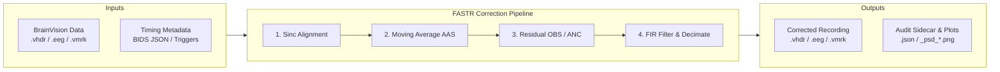

# FASTR-Python

FASTR-Python is the Python version of [FMRIB FASTR](https://github.com/sccn/fMRIb)
for correcting scanner-gradient artifacts in simultaneous EEG-fMRI recordings.

[](https://www.python.org/downloads/)
[](LICENSE)
[](https://github.com/astral-sh/ruff)
[](https://mne.tools)
[](docs/README.md)

---

## Overview

`fastr-python` provides validated, reproducible correction of scanner-gradient
artifacts (GA) in simultaneous EEG-fMRI BrainVision recordings (`.vhdr`, `.eeg`, `.vmrk`).
Built on [MNE-Python](https://mne.tools), NumPy, SciPy, and [pybv](https://pybv.readthedocs.io),
it implements:

- Exact acquisition timing validation (BIDS MRI metadata and measured group triggers);
- Sub-sample temporal alignment and target-excluding moving-average template subtraction (AAS);
- Optional residual Optimal Basis Sets (OBS via PCA) and normalized LMS Adaptive Noise Cancellation (ANC);
- Zero-phase delay-compensated FIR low-pass filtering and integer decimation;
- Stationary mains line-noise regression;
- Quantitative spectral and temporal quality control (residual excess and volume harmonics); and
- Comprehensive cryptographic provenance recorded in a companion JSON sidecar.

The package is `fastr_python`; the command-line entrypoint is `fastr-python`; and the stable Python API is [`fastr_python.api`](src/fastr_python/api.py).

> [!NOTE]
> This is independent Python research software following the method of Niazy et al. (2005)
> and is not affiliated with or endorsed by the FMRIB Centre or the University of Oxford.
> Distributed under GPL-2.0-only; see [`LICENSE`](LICENSE) and [`NOTICE`](NOTICE).

---

## Artifact Scope & Boundary

| Artifact / Noise Source | Origin | In Scope? | Correction Strategy |
| --- | --- | :---: | --- |
| **Gradient Artifact (GA)** | Switching magnetic field gradients during fMRI | Yes | Sub-sample alignment + AAS + optional OBS/ANC |
| **RF Excitation Pulses** | Radiofrequency excitation spikes | Yes | Phase-locked epoch template subtraction |
| **Power-line Noise (50/60 Hz)** | Mains electrical interference | Yes | Stationary sinusoidal regression post-decimation |
| **Ballistocardiogram (BCG)** | Cardiac pulse-driven electrode motion in B0 | No | Requires downstream BCG correction (e.g. FACETpy / EEGLAB) |
| **Gross Motion Artifacts** | Head motion, cable tugging, swallowing | No | Monitored via residual QC; flagged but not interpolated |
| **Electrode Pop / Bad Channels** | Poor contact, transient impedance jumps | No | Diagnostic channel-failure recommendations; channels are never silently dropped |

---

## Processing Pipeline Flow



---

## Installation

FASTR-Python requires **Python 3.12**.

### Development & Reproducible Environment (Recommended)

To install the exact locked scientific dependency tree using [uv](https://docs.astral.sh/uv/):

```bash
uv sync
```

### Standard Environment

To install into an existing active Python 3.12 environment:

```bash
uv pip install .
# or: pip install .
```

Verify the installation:

```bash
fastr-python --version
```

---

## Quickstart

### 1. Synthetic Pipeline Verification (CLI)

Generate a self-contained, deterministic BrainVision dataset and execute correction:

```bash
fastr-python demo --output-dir /tmp/fastr_demo
fastr-python run --config /tmp/fastr_demo/demo.yml
```

> [!NOTE]
> The demo tests the complete numerical and file I/O execution path. It does not replace protocol-specific empirical validation on scanner data.

### 2. High-Level Python API

```python
from fastr_python.api import load_config, run_correction

# Load and strictly validate YAML configuration
config = load_config("examples/configuration.yml")

# Execute end-to-end correction pipeline
summary = run_correction(config)

print(f"Corrected recording written to: {summary.output_vhdr}")
print(f"Total processed volumes: {summary.processed_volumes}")
print(f"Provenance sidecar: {summary.provenance_json}")
```

---

## Acquisition Timing Models

FASTR-Python enforces an explicit, mutually exclusive choice of timing source:

| Trigger Stream | `timing.marker_kind` | Timing Input Source | Acquisition Resolution |
| --- | --- | --- | --- |
| **Volume marker** (1 trigger / TR) | `volume` | BIDS JSON (`input.fmri_metadata`) or inline `acquisition` section | Synthesized from `RepetitionTime`, `SliceTiming`, and `MultibandAccelerationFactor` |
| **Slice marker** (1 trigger / group) | `slice` | Measured trigger sample positions in `.vmrk` | Measured inter-trigger intervals + declared `groups_per_volume` |

Pre-flight validate your timing before executing a full correction run:

```bash
fastr-python validate-timing \
  --metadata /path/to/bold.json \
  --sampling-rate 5000 \
  --vhdr /path/to/raw.vhdr \
  --marker-type Volume \
  --marker-description volume-start \
  --output /path/to/timing-validation.json
```

---

## Outputs & Cryptographic Provenance

Every correction run writes a complete, auditable research package:

| Output Artifact | Purpose & Format |
| --- | --- |
| `corrected.vhdr` / `.eeg` / `.vmrk` | Corrected BrainVision recording with sample-resampled markers and annotated boundary groups. |
| `corrected.json` | Provenance sidecar: SHA-256 hashes of all inputs, resolved timing geometry, execution parameters, software environment versions, and channel QC statistics. |
| `corrected_psd_before.png` | Pre-correction multi-channel power spectral density estimate. |
| `corrected_psd_after.png` | Post-correction multi-channel power spectral density estimate. |

---

## Scientific Limitations & Rigor

> [!WARNING]
> **Artifact suppression alone does not prove correction quality.**
> Scanner gradient harmonics occur at integer multiples of the fundamental volume frequency ($f_k = k / T_R$) and acquisition group frequency ($f_g = m / T_{\text{group}}$). Neural oscillations sharing these frequencies (e.g. 10 Hz alpha during a TR of 0.9 s or 1.0 s) cannot be separated purely by stationary spectral filtering.

Before downstream analysis:
1. Verify SHA-256 hashes and timing geometry in the JSON provenance sidecar.
2. Measure **both** residual harmonic suppression and **independent broadband signal transfer** off-comb.
3. Review `Bad_Gradient` annotations at boundary transitions.
4. Inspect `residual_qc.volume_harmonic_qc` block tables for residual bursts.

Refer to the [Algorithm Guide](docs/algorithm.md) and [Validation Checklist](docs/validation.md) for full scientific guidance.

---

## Documentation Index

Explore the comprehensive project documentation in [`docs/`](docs/README.md):

| Guide | Description |
| --- | --- |
| [**Documentation Portal**](docs/README.md) | Central entry point and documentation roadmap. |
| [**Usage Guide**](docs/usage.md) | Installation, CLI commands, Python API, batch comparison, and outputs. |
| [**Configuration Reference**](docs/configuration.md) | Complete YAML schema, parameter definitions, units, and validation rules. |
| [**Algorithmic Foundations**](docs/algorithm.md) | Mathematical formulation of AAS, OBS, ANC, decimation, and $1/T_R$ physics. |
| [**Architecture & Design**](docs/architecture.md) | Component responsibilities, dependency boundaries, and API contracts. |
| [**Validation Checklist**](docs/validation.md) | Software verification protocols, pilot checks, and quality metrics. |
| [**FMRIB Parity Audit**](docs/fmrib-parity-validation.md) | Implementation audit, MATLAB parity comparisons, and benchmark figures. |
| [**Scientific References**](docs/references.md) | Literature citations, BIDS specs, software foundations, and BibTeX entries. |
| [**Development Guide**](docs/development.md) | Quality gates, contribution standards, and release workflows. |

---

## Citation

If you use FASTR-Python in published neuroimaging research, please cite:

- **Niazy et al. (2005)**: Niazy, R. K., Beckmann, C. F., Iannetti, G. D., Brady, J. M., & Smith, S. M. (2005). *Removal of FMRI environment artifacts from EEG data using optimal basis sets*. NeuroImage, 28(3), 720–737. [doi:10.1016/j.neuroimage.2005.06.067](https://doi.org/10.1016/j.neuroimage.2005.06.067)
- **FASTR-Python Software**: Refer to [`CITATION.cff`](CITATION.cff) for machine-readable citation data.

---

## Development & Quality Assurance

Run the complete read-only quality test suite locally:

```bash
uv sync --locked
uv run ruff check src tests validation
uv run ruff format --check src tests validation
uv run mypy
uv run pytest
git diff --check
uv build
```

