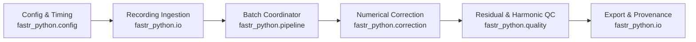

# Software Architecture & System Design

This document details the engineering principles, subsystem boundaries, data flows, and API contracts governing **FASTR-Python**.

---

## 1. Architectural Principles

1. **Strict Separation of Concerns**: Configuration parsing, acquisition geometry, numerical signal processing, file I/O, and quality assurance reside in decoupled packages.
2. **Fail-Fast Boundary Validation**: Validate all configuration and metadata before performing I/O. Resolve and verify temporal geometry before initiating numerical loops. Refuse to write partial files on error.
3. **No Hidden State or Fallbacks**: Behavior is determined entirely by explicit YAML configurations or API parameters. Never guess ambiguous parameters or mask numerical exceptions.
4. **Deterministic Reproducibility**: Given identical input data and configuration, the pipeline generates identical output arrays and bit-for-bit identical cryptographic hashes.
5. **Memory-Bounded Batch Processing**: EEG channels are processed in configurable batches (`channel_batch_size`), ensuring that multi-hour 128-channel recordings can be processed within constrained RAM footprints without numerical divergence.

---

## 2. Subsystem Architecture & Component Flow



---

## 3. Package Responsibilities

The codebase under `src/fastr_python/` is organized into single-responsibility modules:

| Subpackage / Module | Role & Responsibility |
| --- | --- |
| [`api.py`](../src/fastr_python/api.py) | **Stable High-Level API**. Exposes `load_config` and `run_correction`. No internal subpackages should be imported directly by casual users. |
| [`fastr.py`](../src/fastr_python/fastr.py) | **Stable Low-Level Array API**. Exposes `apply_fastr_batch` and `slice_fastr` for direct NumPy array processing. |
| [`cli.py`](../src/fastr_python/cli.py) | **CLI Boundary**. Implements `run`, `validate-timing`, `compare`, and `demo` subcommands via standard `argparse`. |
| `config/` | YAML schema decoding, dataclass configuration models, type coercion, and strict mutual exclusivity validation. |
| `correction/` | Pure numerical algorithms: sub-sample alignment (`geometry.py`), moving average AAS & OBS (`fastr.py`, `processing.py`), adaptive filters (`anc.py`), and trigger resolution (`timing.py`). Contains no disk I/O. |
| `io/` | Reading and writing BrainVision Core Data Format files (`.vhdr`, `.eeg`, `.vmrk`) and marker streams via [pybv](https://pybv.readthedocs.io). |
| `pipeline/` | Orchestration layer: coordinates channel batching, window slicing, marker resampling, and cryptographic provenance sidecar assembly. |
| `quality/` | Quality control: ZoomFFT exact harmonic analysis, Welch PSD estimation, and robust block residual detection. |
| `validation/` | Research validation test harness: synthetic artifact simulation, Tone Transfer Function (TTF), and MATLAB reference comparison runners. |
| `compare/` | Directory-level batch comparison tool evaluating residual metrics across cohorts. |

---

## 4. Public API Contracts

FASTR-Python strictly separates public entrypoints from internal implementation details:

### High-Level Configuration API

```python
from fastr_python.api import FastrSummary, load_config, run_correction

# load_config returns a frozen, immutable FastrConfig instance
config = load_config("configuration.yml")

# run_correction executes the pipeline and returns execution metadata
summary: FastrSummary = run_correction(config)
```

### Low-Level Array API

```python
from fastr_python.fastr import apply_fastr_batch, slice_fastr

# Functions accept validated 2D/3D float NumPy arrays and return corrected arrays
```

The package root (`fastr_python/__init__.py`) exports only `__version__`. It intentionally does not eagerly import heavy scientific dependencies (such as MNE or Matplotlib) at module load time.

---

## 5. Production vs Validation Isolation

To ensure that production pipeline runs are lightweight and free of testing overhead:
- **Production Pipeline** depends exclusively on `config`, `correction`, `io`, `pipeline`, and `quality`.
- **Validation Harness** (`fastr_python.validation`) contains simulation engines and benchmark scripts. Production code never imports `fastr_python.validation`.

---

## 6. Physical Units & Coordinate Invariants

To avoid unit ambiguity across different scientific domains:

- **Signal Data**: Volts ($\mathrm{V}$) internally following MNE-Python norms.
- **Residual Reports**: Microvolts ($\mu\mathrm{V}$).
- **Time**: Seconds ($\mathrm{s}$).
- **Frequency**: Hertz ($\mathrm{Hz}$).
- **Array Indexing**: 0-based in Python code; 1-based in on-disk BrainVision marker files.
- **Variable Suffixes**: Variable names explicitly embed units where ambiguity is possible (e.g. `sampling_rate_hz`, `repetition_time_seconds`, `residual_threshold_uv`).

